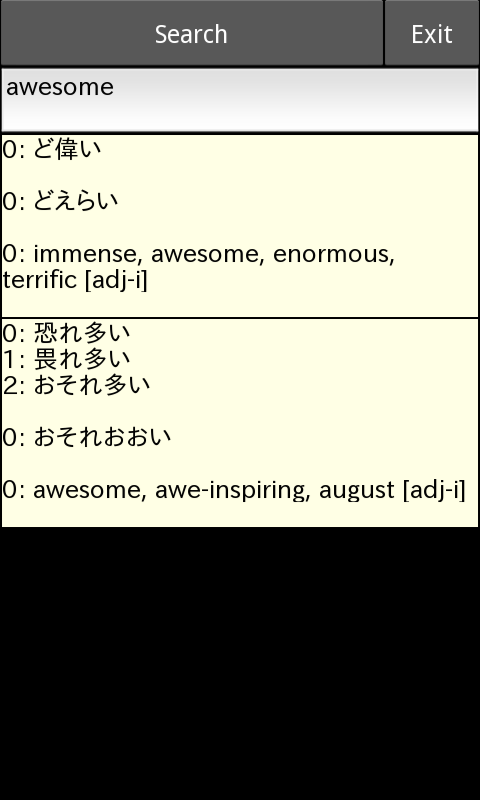
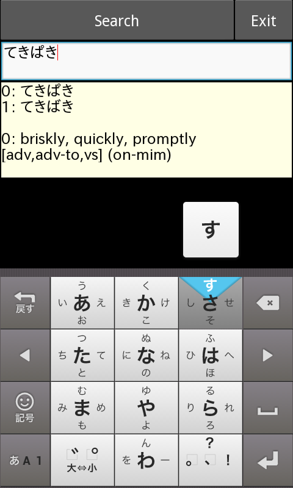

midori
======

Japanese dictionary Android app

Dependencies:
- kivy/python-for-android
- pyparsing

This is an Android version of my favorite Japanese-English dictionary app.
I found the sqlite3 database in the original app's folder on my jailbroken iPad.

The skeleton database midori.db is limited to entries that contain the word 'example'. This is to avoid breaching any copyrights.


## Build/Install
1. Set-up [http://python-for-android.readthedocs.org/en/latest/toolchain/](python-for-android)
2. Cross-compile Python with the required extensions/dependencies:
```
python-for-android/distribute.sh -m 'kivy sqlite3 pyparsing'
```
3. Connect the Android device (set *Settings* > *Developer options* > *USB debugging*), then build and push the app: 
```
python-for-android/dist/default/build.py --package org.example.midori --name "Midori" --version 1 --dir path/to/midori --orientation portrait debug installd
```

<div align="center">
<span> </span>
</div>
